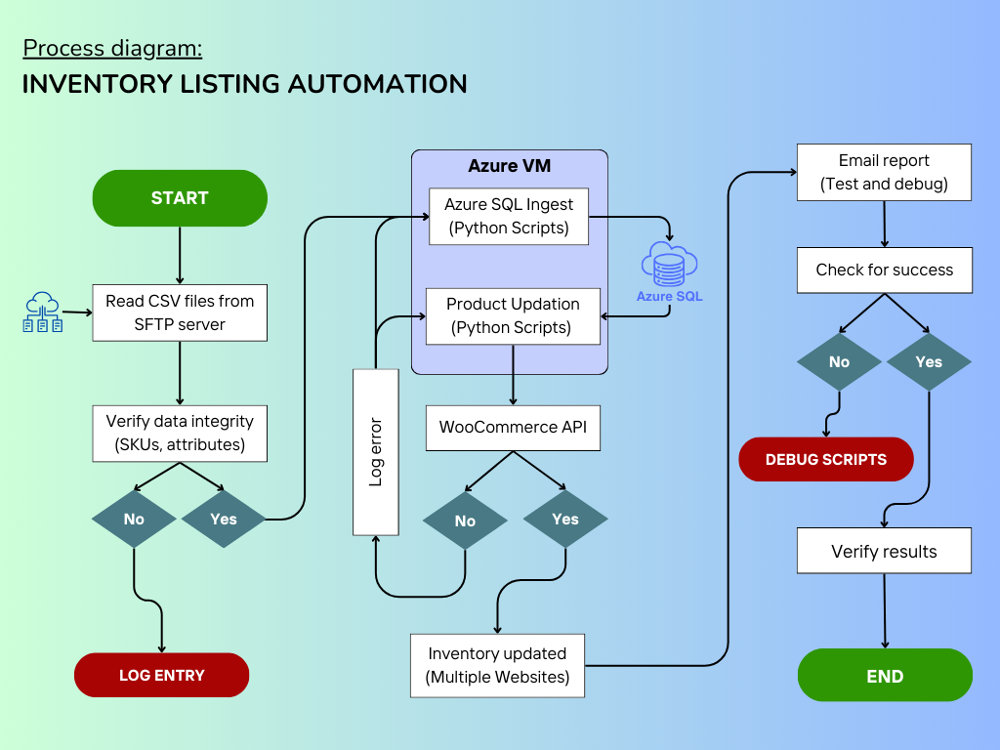

# invmgmt
This project contains code for managing inventory on woocommerce.
1. [insert_products.py](insert_products.py) will download csv files from multiple vendors' sftp servers using [ftplib](https://docs.python.org/3.12/library/ftplib.html#ftplib.FTP) library.
2. Read the downloaded csv file using [pandas](https://pypi.org/project/pandas/) library.
3. Create connection with [Azure SQL Database](https://azure.microsoft.com/en-us/products/azure-sql/database) and run multiple queries using [sqlalchemy](https://pypi.org/project/SQLAlchemy/) library to ingest products and their inventory in database.
4. Later, this data is used to update inventory in woocommerce using its API.

